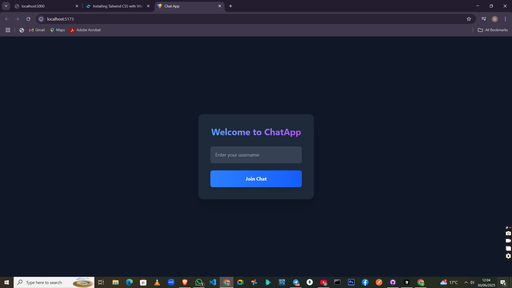
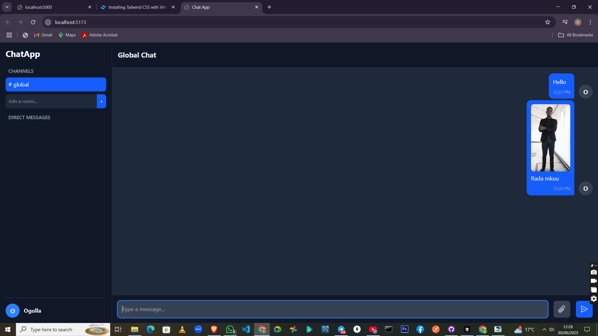
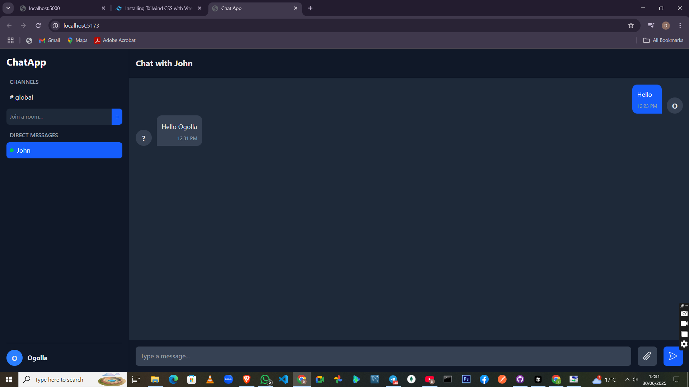

# 🚀 Real-Time Chat Application

This is a full-featured, real-time chat application built with a modern technology stack, including Node.js, React, Vite, and Socket.io. It features a sleek, responsive, dark-themed interface and supports a wide range of interactive functionalities, from private messaging and file sharing to message reactions.

## ✨ Features Implemented

### Core Functionality
- **User Presence**: Simple username registration to join the chat.
- **Real-Time Communication**: Instant, bidirectional messaging powered by WebSockets.
- **Online User List**: See a list of all currently connected users in real-time.

### Advanced Chat Features
- **Global Chat**: A central chat room where all users can communicate.
- **Private Messaging**: Click on any user in the "Online Users" list to start a secure, one-on-one private chat.
- **Dynamic Chat Rooms**:
  - Create new chat rooms on the fly.
  - Join existing rooms.
  - Switch seamlessly between different rooms and chats.
- **File & Image Sharing**:
  - Send and receive files or images in any chat context (global, private, or room).
  - Includes image previews before sending and clickable previews in the chat.
- **Message Reactions**:
  - React to any message with a selection of emojis (👍, ❤️, 😂, 😮, 😢, 🙏).
  - Reactions are displayed in an aggregated format on each message bubble.
  - A clean reaction picker appears on hover.

### UI/UX & Notifications
- **Modern Dark Theme**: A visually appealing and professional dark mode interface.
- **Responsive Design**: The UI is fully responsive and works well on both desktop and mobile devices, featuring a collapsible sidebar for smaller screens.
- **Connection Status Indicator**: A banner notifies the user if the connection to the server is lost and is attempting to reconnect.
- **Auto-Scrolling**: The chat window automatically scrolls to the latest message.
- **Intuitive Icons**: The interface uses SVG icons for clarity and a clean aesthetic.

---

## 💻 Technology Stack

### Backend
- **Runtime**: [Node.js](https://nodejs.org/)
- **Framework**: [Express](https://expressjs.com/)
- **Real-Time Engine**: [Socket.io](https://socket.io/)
- **Development Utility**: [Nodemon](https://nodemon.io/) for automatic server restarts.

### Frontend
- **Framework**: [React](https://reactjs.org/)
- **Build Tool**: [Vite](https://vitejs.dev/)
- **Styling**: [Tailwind CSS v4](https://tailwindcss.com/)
- **Real-Time Engine**: [Socket.io Client](https://socket.io/docs/v4/client-installation/)

---

## ⚙️ Setup and Installation

Follow these steps to get the project running locally on your machine.

### Prerequisites
- **Node.js**: v18+ recommended.
- **Package Manager**: [pnpm](https://pnpm.io/installation) is used in this project, but `npm` or `yarn` can also be used.

### 1. Clone the Repository
```sh
git clone <your-repository-url>
cd <repository-folder>
```

### 2. Backend Setup
Navigate to the server directory, install dependencies, and start the development server.
```sh
# Go to the server folder
cd server

# Install dependencies
pnpm install

# Start the server (runs on http://localhost:5000)
pnpm run dev
```

### 3. Frontend Setup
In a **new terminal window**, navigate to the client directory, install dependencies, and start the development server.
```sh
# Go to the client folder
cd client

# Install dependencies
pnpm install

# Start the frontend dev server (runs on http://localhost:5173 or another available port)
pnpm run dev
```

### 4. Open and Use the Application
- Open your web browser and navigate to the local URL provided by Vite (e.g., `http://localhost:5173`).
- You will be prompted to enter a username to join the chat.
- Once joined, you can send messages, join rooms, and interact with other users.

---

## 📸 Screenshots

**Login Screen**


**Main Chat Interface**


**Private Messaging View**



## Deployment URLs
Frontend - http://my-projects-yhr7.vercel.app/
Backend - https://chat-app-d0zp.onrender.com/
